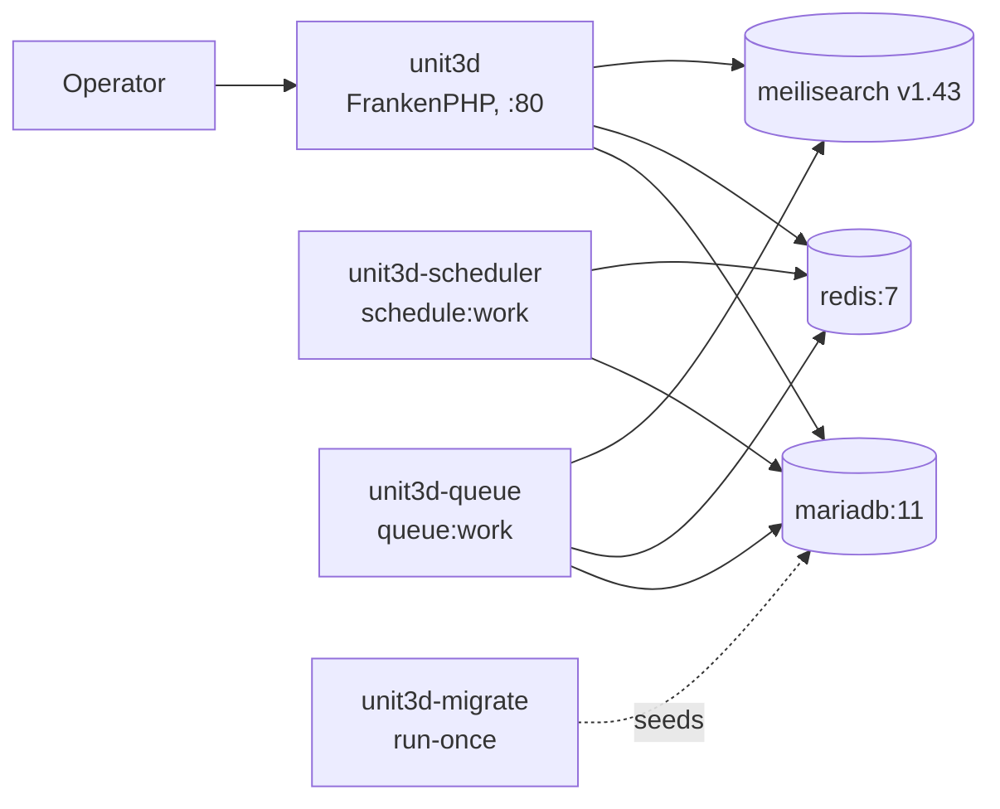

# ratatoskr — Compose deployment

UNIT3D Community Edition on FrankenPHP, MariaDB, Redis, MeiliSearch.
Single-host, production-shaped local stack.

⚠️ Read [DISCLAIMER.md](../DISCLAIMER.md) before deploying.
This is infrastructure only — operators are responsible for what they distribute.

## Quick start

```bash
git clone https://github.com/john6810/ratatoskr.git
cd ratatoskr/compose
cp .env.example .env
# Edit .env — replace every CHANGEME (see "Required secrets" below)
docker compose up -d --build
# Open http://localhost:8080 — log in with DEFAULT_OWNER_NAME / DEFAULT_OWNER_PASSWORD
```

Five steps: clone → copy env → edit → up → browse.

## Required secrets

Generate once, paste into `.env`:

| Var | Generate with |
|---|---|
| `APP_KEY` | `printf "base64:%s\n" "$(openssl rand -base64 32)"` |
| `MARIADB_ROOT_PASSWORD` | `openssl rand -base64 24` |
| `DB_PASSWORD` | `openssl rand -base64 24` |
| `REDIS_PASSWORD` | `openssl rand -base64 24` |
| `MEILISEARCH_KEY` | `openssl rand -base64 24` |
| `DEFAULT_OWNER_PASSWORD` | strong password for the bootstrap admin |

`APP_KEY` is generated once and never rotated. Rotating breaks every
encrypted column and signed URL in the database.

## Architecture



`unit3d-migrate` is a one-shot service (`restart: no`) that runs
`php artisan migrate --force --seed`. It waits for `mariadb`, `redis`,
`meilisearch` to be healthy. `unit3d`, `unit3d-scheduler`, `unit3d-queue`
all wait for `unit3d-migrate` to complete successfully before starting.

## Local-only by default

`unit3d` binds to `127.0.0.1:8080` — never `0.0.0.0`. To expose it externally,
front the stack with a reverse proxy (Traefik, Caddy, Nginx) that terminates
TLS and forwards to `127.0.0.1:8080`. Do not edit the published port in
`docker-compose.yml` to expose it directly.

The announce URL is permanent — once `.torrent` files are distributed, the
domain is baked in forever. Choose carefully before going public.

## Volumes

| Volume | Mount | Backs up |
|---|---|---|
| `mariadb-data` | `/var/lib/mysql` | database |
| `redis-data` | `/data` | AOF persistence |
| `meilisearch-data` | `/meili_data` | search index |
| `unit3d-storage` | `/app/storage` | avatars, banners, `.torrent` files, logs |

Back up these four; everything else rebuilds from the image.

## Common operations

```bash
# Tail app logs
docker compose logs -f unit3d

# One-off artisan command
docker compose exec unit3d php artisan tinker

# Re-run migrations (after a UNIT3D bump in .env)
docker compose run --rm unit3d-migrate

# Stop containers; volumes survive
docker compose down

# Remove containers AND volumes (data loss)
docker compose down -v
```

## What this stack is not

- **Not multi-host.** Use [`../kustomize/`](../kustomize/) or [`../helm/`](../helm/) for K8s.
- **Not HA.** One replica per service, all on the same host.
- **Not for public exposure as-is.** No TLS, no `/announce` rate limiting, no DDoS protection. Front it with a reverse proxy.

## Versions pinned

| Component | Pin |
|---|---|
| UNIT3D | `v9.2.0` (build ARG, override with `UNIT3D_VERSION=...`) |
| FrankenPHP | `1-php8.4` (Dockerfile ARG) |
| MariaDB | `11` (currently 11.8 LTS, EOL 2028-06-04) |
| Redis | `7-alpine` (currently 7.2) |
| MeiliSearch | `v1.43` |

Run the [`check-upstream-versions`](../.claude/skills/check-upstream-versions/SKILL.md) skill before bumping. The authoritative pin lives in [`../.claude/CLAUDE.md`](../.claude/CLAUDE.md) and [`../docker/Dockerfile`](../docker/Dockerfile).
