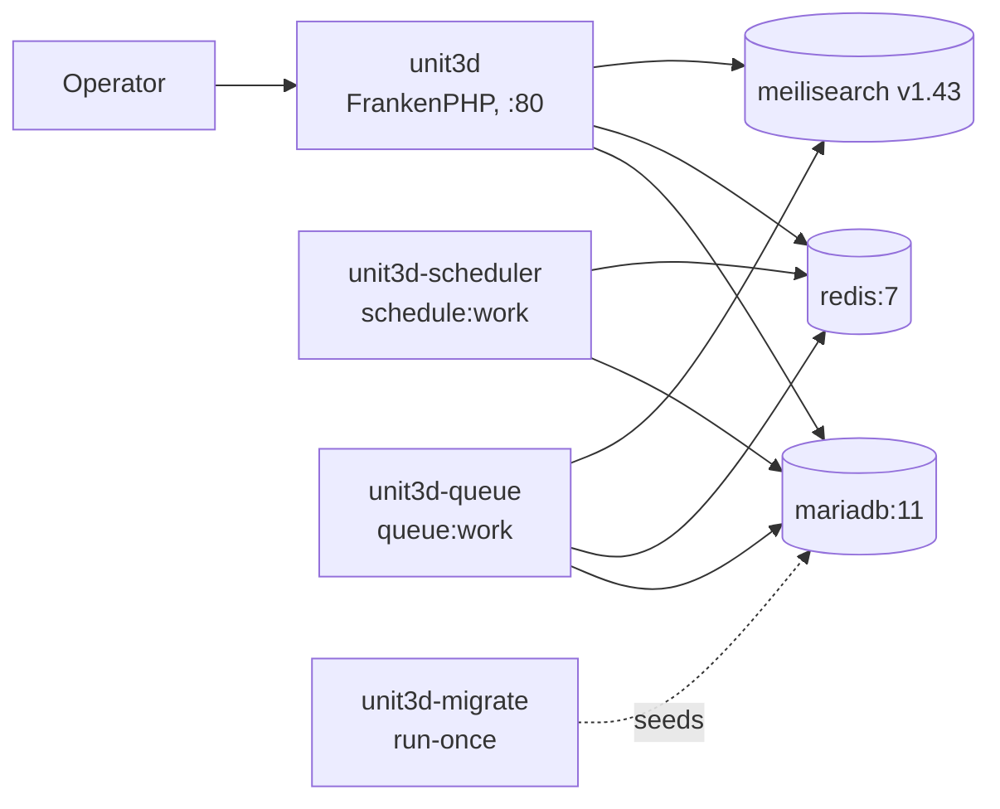

# ratatoskr — Compose deployment

UNIT3D Community Edition on FrankenPHP, MariaDB, Redis, MeiliSearch.
Single-host, production-shaped local stack.

⚠️ Read [DISCLAIMER.md](../DISCLAIMER.md) before deploying.
This is infrastructure only — operators are responsible for what they distribute.

## Quick start

```bash
git clone https://github.com/john6810/ratatoskr.git
cd ratatoskr/compose
cp .env.example .env
# Edit .env — replace every CHANGEME (see "Required secrets" below)
docker compose up -d --build
# Open http://localhost:8080 — log in with DEFAULT_OWNER_NAME / DEFAULT_OWNER_PASSWORD
```

Five steps: clone → copy env → edit → up → browse.

## Required secrets

Generate once, paste into `.env`:

| Var | Generate with |
|---|---|
| `APP_KEY` | `printf "base64:%s\n" "$(openssl rand -base64 32)"` |
| `MARIADB_ROOT_PASSWORD` | `openssl rand -hex 32` |
| `DB_PASSWORD` | `openssl rand -hex 32` |
| `REDIS_PASSWORD` | `openssl rand -hex 32` |
| `MEILISEARCH_KEY` | `openssl rand -hex 32` |
| `DEFAULT_OWNER_PASSWORD` | `openssl rand -hex 32` (or a strong memorable password) |

`hex` over `base64`: hex output is `[0-9a-f]` only, safe inside any shell
heredoc, SQL `IDENTIFIED BY` clause, JSON value, or `.env` parser. Base64
output can include `=`, `+`, `/`, which break naive interpolation in those
contexts. `APP_KEY` keeps the `base64:` prefix because Laravel parses it
specifically — that's a Laravel format, not a generic password.

`APP_KEY` is generated once and never rotated. Rotating breaks every
encrypted column and signed URL in the database.

## Architecture



`unit3d-migrate` is a one-shot service (`restart: no`) that runs
`php artisan migrate --force --seed`. It waits for `mariadb`, `redis`,
`meilisearch` to be healthy. `unit3d`, `unit3d-scheduler`, `unit3d-queue`
all wait for `unit3d-migrate` to complete successfully before starting.

## Local-only by default

`unit3d` binds to `127.0.0.1:8080` — never `0.0.0.0`. To expose it externally,
front the stack with a reverse proxy (Traefik, Caddy, Nginx) that terminates
TLS and forwards to `127.0.0.1:8080`. Do not edit the published port in
`docker-compose.yml` to expose it directly.

The announce URL is permanent — once `.torrent` files are distributed, the
domain is baked in forever. Choose carefully before going public.

## Volumes

| Volume | Mount | Backs up |
|---|---|---|
| `mariadb-data` | `/var/lib/mysql` | database |
| `redis-data` | `/data` | AOF persistence |
| `meilisearch-data` | `/meili_data` | search index |
| `unit3d-storage` | `/app/storage` | avatars, banners, `.torrent` files, logs |

Back up these four; everything else rebuilds from the image. The v0.2 backup
tooling covers `mariadb-data` (the only volume that is not reconstructible
from external state) — see [Backup & restore](#backup--restore) below.

## Common operations

```bash
# Tail app logs
docker compose logs -f unit3d

# One-off artisan command
docker compose exec unit3d php artisan tinker

# Re-run migrations (after a UNIT3D bump in .env)
docker compose run --rm unit3d-migrate

# Stop containers; volumes survive
docker compose down

# Remove containers AND volumes (data loss)
docker compose down -v
```

## Restoring MeiliSearch indexes

`unit3d-migrate` pushes the index settings (`filterableAttributes`, etc.)
on every boot via `scout:sync-index-settings`, but it intentionally does
not re-import every row — that would block boot for hours on a populated
tracker. Ongoing drift is handled by UNIT3D's
`auto:sync_torrents_to_meilisearch` scheduled command (every 15 min,
delta-only) running inside `unit3d-scheduler`.

Run a manual backfill only if MeiliSearch lost data, the index was
manually flushed, or a UNIT3D upgrade changed `toSearchableArray()`:

```bash
docker compose run --rm unit3d-migrate sh -c '
  php artisan scout:flush "App\\Models\\Torrent" &&
  php artisan scout:flush "App\\Models\\Person" &&
  php artisan scout:import "App\\Models\\Torrent" &&
  php artisan scout:import "App\\Models\\Person"
'
```

`scout:flush` empties the Meili index, `scout:import` re-pushes every row
in 500-batch chunks. On a multi-million-row tracker plan for hours, not
minutes — run during a maintenance window.

## Backup & restore

ratatoskr v0.2 ships a dedicated backup image (`ratatoskr/unit3d-backup`)
built on the same MariaDB version as the server, so `mariadb-backup` is
exact-version matched (upstream MariaDB requirement). Snapshots are
streamed through `zstd -3` and written into a Restic repository — Restic
provides AES-256 client-side encryption (mandatory for compliance), dedup,
and a backend-agnostic transport (B2 default; S3, MinIO, R2, SFTP, local
paths are supported by changing one env var).

The full operator guide — including B2 setup, GDPR retention, key escrow,
host cron and systemd timer recipes — lands in
[`docs/backup-restore.md`](../docs/backup-restore.md) (v0.2.0 commit #4).
What follows is the minimum to run backups from this Compose stack today.

### Scope

- Backed up: **`mariadb-data`** only. The other three volumes
  (`redis-data`, `meilisearch-data`, `unit3d-storage`) are reconstructible
  — Redis from MariaDB on Laravel queue boot, MeiliSearch by re-indexing,
  storage by re-uploading or restoring from S3 (the path the K8s overlay
  takes in v0.4). Future minor releases will add MeiliSearch and
  `unit3d-storage` snapshots; the database is the only one that is
  unrecoverable if lost.
- Not part of this profile: backup *scheduling*. The container is one-shot
  (`restart: no`); a host-side cron or systemd timer invokes it daily.
  Putting cron inside the container is poor Docker hygiene and the timer
  is harder to debug from the host.

### One-time setup

Run these once your stack is healthy (`docker compose ps` shows `mariadb`
healthy). Both fresh and upgrade paths assume MariaDB is running before
the user-creation step.

1. **Create the MariaDB backup user** (SQL snippet — manual on purpose).

   We do not ship a `docker-entrypoint-initdb.d` script because that hook
   only runs on a fresh data volume, leaving operators who upgrade from
   v0.1.x without the user. A single manual step covers both new and
   upgraded deployments uniformly.

   ```bash
   # Generate the backup user's password into the secret file. hex output
   # is shell/SQL/JSON-safe — no quoting hazards in the heredoc below.
   mkdir -p secrets && chmod 700 secrets
   openssl rand -hex 32 | tr -d '\n' > secrets/mariadb_backup_password
   chmod 600 secrets/mariadb_backup_password

   # Create the user with the same password and grant the minimum
   # privileges mariadb-backup requires (RELOAD, PROCESS, LOCK TABLES,
   # BACKUP_ADMIN). The MariaDB root password is read from .env via -e
   # (env var inside the container) instead of -p (argv leak).
   # `cut -d= -f2-` (trailing -) keeps everything after the first =, so
   # passwords containing = survive. With hex passwords this is moot but
   # the form is the right one regardless.
   ROOT_PWD=$(grep ^MARIADB_ROOT_PASSWORD .env | cut -d= -f2-)
   docker compose exec -e MYSQL_PWD="$ROOT_PWD" -T mariadb \
       mariadb -u root <<EOF
   CREATE USER IF NOT EXISTS 'backup'@'%' IDENTIFIED BY '$(cat secrets/mariadb_backup_password)';
   GRANT RELOAD, PROCESS, LOCK TABLES, BACKUP_ADMIN ON *.* TO 'backup'@'%';
   FLUSH PRIVILEGES;
   EOF
   unset ROOT_PWD
   ```

2. **Create the Restic repository password.**

   ```bash
   openssl rand -hex 32 | tr -d '\n' > secrets/restic_password
   chmod 600 secrets/restic_password
   ```

   ⚠️ **Key escrow is non-negotiable.** Losing this password makes every
   snapshot unreadable. Print it and lock it in a safe, store a copy in a
   password manager you control, or split it via Shamir secret sharing.
   `docs/backup-restore.md` (commit #4) covers strategies in depth.

3. **Configure the backup environment.**

   ```bash
   cp .env.backup.example .env.backup
   # Edit .env.backup — at minimum set RESTIC_REPOSITORY and B2_*
   ```

4. **Build the backup image** (once; rebuild on bumps).

   ```bash
   docker compose -f docker-compose.yml -f docker-compose.backup.yml \
       --profile backup build unit3d-backup
   ```

### Run a one-shot backup

```bash
docker compose -f docker-compose.yml -f docker-compose.backup.yml \
    --profile backup run --rm unit3d-backup
```

The first run initializes the Restic repository (`restic init` is invoked
implicitly by the script). Each subsequent run streams `mariadb-backup
--backup --stream=xbstream | zstd -3 | restic backup --stdin`, then runs
`restic forget --keep-daily 30 --prune` (gated on `BACKUP_PRUNE=true`).

### Restore drill — verify the latest snapshot is restorable

```bash
docker compose -f docker-compose.yml -f docker-compose.backup.yml \
    --profile backup run --rm unit3d-backup restore-test
```

Pulls the latest snapshot to a `mktemp -d` scratch directory inside the
container, runs `mariadb-backup --prepare`, spawns an ephemeral
`mariadbd --skip-networking --skip-grant-tables` on a Unix socket, queries
`SELECT COUNT(*) FROM users` and `FROM torrents`, and asserts at least one
row in `users` (the bootstrap admin from `DEFAULT_OWNER_*`). Exit 0 = drill
passed; exit 1 = drill failed and the operator must investigate before
relying on the backup. Run this after every change to the backup image,
script, or schedule. v0.2 commit #5 ships a Claude Code skill that gates
commits touching `scripts/backup*.sh` on a successful drill.

### Restore — DESTRUCTIVE, MariaDB must be stopped

```bash
# Stop everything that holds open connections to mariadb
docker compose stop unit3d unit3d-scheduler unit3d-queue
docker compose stop mariadb

# Wipe the datadir and copy back from the latest snapshot. RESTORE_FORCE
# is mandatory because mariadb-data is non-empty after step 2.
docker compose -f docker-compose.yml -f docker-compose.backup.yml \
    --profile backup run --rm \
    -e RESTORE_FORCE=true unit3d-backup restore latest

# Bring everything back up
docker compose start mariadb
docker compose start unit3d unit3d-scheduler unit3d-queue
```

The backup container has read-write access to `mariadb-data`. The
`scripts/restore.sh` `RESTORE_FORCE=true` guard is the safety net — any
restore against a non-empty datadir without that env var refuses to
proceed. Backup mode never writes to the datadir; restore mode writes
only after the operator explicitly opts in.

### Daily schedule (host cron)

```cron
# /etc/cron.d/ratatoskr-backup — runs daily at 03:00 host time
0 3 * * * root cd /opt/ratatoskr/compose && \
    docker compose -f docker-compose.yml -f docker-compose.backup.yml \
        --profile backup run --rm unit3d-backup \
    >> /var/log/ratatoskr-backup.log 2>&1
```

A systemd timer alternative (cleaner logging, retry policy via
`OnFailure=`, `Persistent=true` for missed runs after host downtime) is
documented in `docs/backup-restore.md` (commit #4).

## What this stack is not

- **Not multi-host.** Use [`../kustomize/`](../kustomize/) or [`../helm/`](../helm/) for K8s.
- **Not HA.** One replica per service, all on the same host.
- **Not for public exposure as-is.** No TLS, no `/announce` rate limiting, no DDoS protection. Front it with a reverse proxy.

## Versions pinned

| Component | Pin |
|---|---|
| UNIT3D | `v9.2.0` (build ARG, override with `UNIT3D_VERSION=...`) |
| FrankenPHP | `1-php8.4` (Dockerfile ARG) |
| MariaDB | `11` (currently 11.8 LTS, EOL 2028-06-04) |
| Redis | `7-alpine` (currently 7.2) |
| MeiliSearch | `v1.43` |

Run the [`check-upstream-versions`](../.claude/skills/check-upstream-versions/SKILL.md) skill before bumping. The authoritative pin lives in [`../.claude/CLAUDE.md`](../.claude/CLAUDE.md) and [`../docker/Dockerfile`](../docker/Dockerfile).
