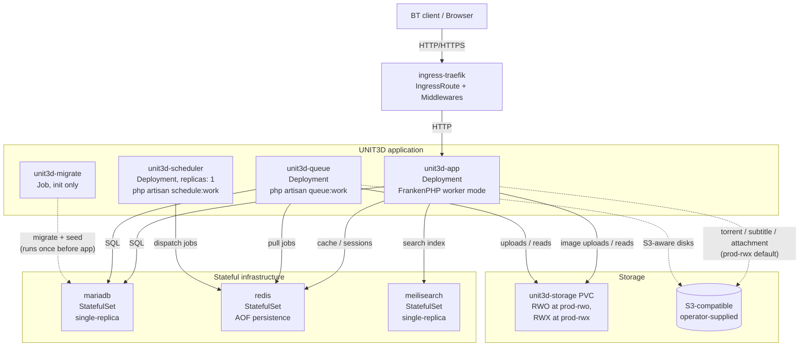
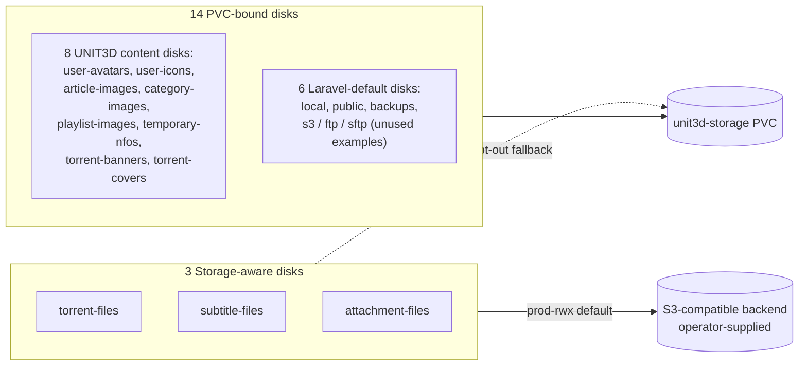
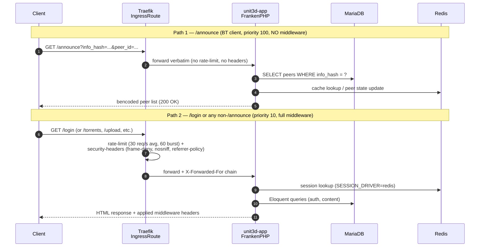

# Architecture

This document describes the runtime architecture of a ratatoskr deployment: which Kubernetes resources exist, how traffic and data flow between them, and how the three overlays (`dev`, `prod-rwo`, `prod-rwx`) shape the topology. It targets operators planning a deployment and contributors orienting themselves in the codebase.

This is the *what* — for the *why* behind each decision (database topology, storage strategy, ingress controller, secrets, HA boundary), see the [Architecture Decision Records](./adr/) referenced inline and in [See also](#see-also).

## Component overview

The diagram shows runtime data dependencies between the eight ratatoskr-managed workloads and the storage backends. Solid edges are always present; dashed edges represent the S3 routing path that activates by default in `prod-rwx` and is opt-in elsewhere ([ADR-0002](./adr/0002-storage-strategy-unit3d-storage.md)).

What's not in the diagram and why:

- **cert-manager** (`ClusterIssuer` + `Certificate`) is provisioned by the [`ingress-traefik` Component](../kustomize/components/ingress-traefik/) but is not a runtime dependency for `unit3d-app` itself. It populates the TLS Secret that Traefik consumes; failure of cert-manager affects certificate renewal, not user requests in the steady state.
- **KEDA controller** is opt-in via the [`keda-queue-scaler` Component](../kustomize/components/keda-queue-scaler/). When enabled, KEDA's controller pod (in the operator's `keda` namespace) replaces the CPU-based HPA on `unit3d-queue` and scales it from Redis queue length — but the operator manages KEDA itself; ratatoskr only ships the `ScaledObject`.
- **sealed-secrets controller** is the operator's cluster concern; ratatoskr ships templates under [`kustomize/base/secrets-templates/`](../kustomize/base/secrets-templates/) but does not deploy the controller.
- **NetworkPolicies** (8 of them under `kustomize/base/networkpolicies/`) are policy resources, not runtime components. They gate the edges shown above by source/destination labels and ports.

## Storage strategy

UNIT3D v9.2.0 declares 17 Laravel filesystem disks. Three of them are *Storage-aware* (write through `Storage::disk(...)->put`/`putFileAs`/`storeAs`) and can swap to an S3 driver cleanly. The remaining 14 hardcode `'driver' => 'local'` upstream and would break on an S3 driver — they're held on a `unit3d-storage` PVC. Full rationale and the upstream-PR roadmap to lift the asymmetry are in [ADR-0002](./adr/0002-storage-strategy-unit3d-storage.md).

| Disk | Driver (v9.2.0) | Write style | prod-rwo backend | prod-rwx backend |
|---|---|---|---|---|
| `torrent-files` | `local` | Storage-aware | PVC | **S3** (default) |
| `subtitle-files` | `local` | Storage-aware | PVC | **S3** (default) |
| `attachment-files` | `local` | Storage-aware | PVC | **S3** (default) |
| `user-avatars` | `local` | path-bypass | PVC | PVC |
| `user-icons` | `local` | path-bypass | PVC | PVC |
| `article-images` | `local` | path-bypass | PVC | PVC |
| `category-images` | `local` | path-bypass | PVC | PVC |
| `playlist-images` | `local` | path-bypass | PVC | PVC |
| `temporary-nfos` | `local` | `UploadedFile::move` | PVC | PVC |
| `torrent-banners` | `local` | path-bypass | PVC | PVC |
| `torrent-covers` | `local` | path-bypass | PVC | PVC |
| `local` / `public` / `backups` | `local` | Laravel default | PVC | PVC |
| `s3` / `ftp` / `sftp` | various | unused examples | n/a | n/a |

The asymmetry exists because the 14 path-bypass disks call `Storage::disk(...)->path()` followed by Intervention Image's `Image::make(...)->save($path)` (or Symfony's `UploadedFile::move($path, ...)`). Both write to a local filesystem path; on an S3 driver, `->path()` raises `LogicException: This driver does not support retrieving paths`. Lifting these requires upstream PRs to refactor the controllers to `Storage::disk(...)->put(...)` — tracked in [`docs/upstream-prs.md`](./upstream-prs.md). v0.4 hard-depends on those PRs landing for full app-tier statelessness.

## Request flow

The `/announce` route has a hard contract: byte-identical bencoded response, no middleware-induced modifications. Other routes get rate-limit + security headers. The `ingress-traefik` Component implements this as a two-Route split inside a single `IngressRoute`, with priority 100 on `/announce` and priority 10 on the catch-all.

The split is structurally enforced — Route 1 has no `middlewares:` field at all, so even if an operator adds a global `unit3d-rate-limit` patch by mistake, the announce path stays middleware-free. The empty middleware list on Route 1 is the canonical signal: any review touching the IngressRoute checks that field first. See [ADR-0003](./adr/0003-ingress-controller-assumption.md) for the BitTorrent-client compatibility rationale (rtorrent and older qBittorrent variants don't reliably follow redirects, body rewrites corrupt bencoded payloads, gzip on small announce responses risks broken decoders for marginal bandwidth gain).

`TRUSTED_PROXIES` in the `unit3d-config` ConfigMap covers the ingress controller's pod CIDR (default: RFC1918 + RFC4193 + IPv6 link-local; tightenable to a specific pod CIDR per the `prod-rwx` README). Without it, every request appears to come from the ingress pod's IP — peer tracking, ratio enforcement, ban hammer, and rate limits all break in subtle and noisy ways.

## Scaling envelope

| Capability | `dev` | `prod-rwo` | `prod-rwx` |
|---|---|---|---|
| `unit3d-app` replicas | 1 | 1 (Recreate) | 2-10 (HPA, RollingUpdate maxSurge: 1 / maxUnavailable: 0) |
| `unit3d-queue` replicas | 1 | 1 (Recreate) | 2-8 (HPA CPU 70% or KEDA opt-in) |
| `unit3d-scheduler` | 1 (hard) | 1 (hard) | 1 (hard, [ADR-0005](./adr/0005-ha-boundary-v0.3.md)) |
| MariaDB | 1 (base sizing) | 1 (base sizing) | 1 (sized 2x, PVC 50Gi) |
| Storage RW mode | RWO | RWO | RWX |
| S3 routing | optional | optional | default ON |
| HPA | none | none | `unit3d-app` (CPU + Memory) + `unit3d-queue` (CPU) |
| PDB | none | none | `unit3d-app` + `unit3d-queue` (`minAvailable: 1`) |
| Ingress | optional | `ingress-traefik` (default) | `ingress-traefik` (default) |
| Sealed-secrets | optional | mandatory (4 secrets) | mandatory (5 incl. S3 creds) |
| Target user envelope | smoke test | ~1K-3K | ~5K-10K |

The `prod-rwx` envelope holds up to roughly 50K active users with the single-replica MariaDB sized appropriately (operators bump the `mariadb-resources.yaml` patch in their fork past base sizing for that range). Beyond ~50K users, MariaDB becomes the bottleneck; v0.7 will add Galera HA per the [ADR-0001](./adr/0001-database-deployment-topology.md) reopen note. Redis and MeiliSearch single-replica are comfortable through the `prod-rwx` envelope — see [ADR-0005](./adr/0005-ha-boundary-v0.3.md) for the per-component HA boundary and the successor-ADR roadmap.

## GitOps flow

ratatoskr ships an [ArgoCD `ApplicationSet` reference template](../argocd/applicationset.yaml) using the Git directory generator. By default it scans `kustomize/overlays/*` and produces one `Application` per overlay, deployed to per-overlay namespaces (`unit3d-dev`, `unit3d-prod-rwo`, `unit3d-prod-rwx`) so multiple overlays can coexist on a shared cluster without resource name collisions.

Operators customize the ApplicationSet in their fork via three patterns:

- **Smoke-test (default)**: keep the wildcard, deploy all overlays for end-to-end testing.
- **Single overlay (typical production)**: restrict the generator's `directories:` to one path (e.g. `kustomize/overlays/prod-rwx`) — most operators run exactly one ratatoskr overlay per cluster.
- **Multi-cluster**: combine the Git directory generator with a Cluster generator in a Matrix for fleet deployments. Each cluster registered with ArgoCD and labeled `ratatoskr.io/deploy=true` gets the configured overlay.

Sync policy: `automated` + `prune` + `selfHeal`, plus `ServerSideApply=true` (handles cert-manager, Traefik, KEDA, and sealed-secrets CRDs cleanly), `CreateNamespace=true`, foreground prune propagation with `PruneLast=true` so CRD-instance resources are cleaned up before their CRDs. Retry: 5 attempts with exponential backoff up to 5 minutes, recovering from initial-deploy transient errors (CRDs not yet installed by the time ArgoCD tries to apply, network blips, registry rate limits).

Full operator workflow including KEDA install prerequisite, sealed-secrets pre-population, and ingress namespace labeling is in [`argocd/README.md`](../argocd/README.md).

## See also

- [ADR-0001 — Database deployment topology](./adr/0001-database-deployment-topology.md): MariaDB single-replica until v0.7 Galera, managed-DB toggle for operators on RDS / Aiven / OVH.
- [ADR-0002 — Storage strategy for `unit3d-storage`](./adr/0002-storage-strategy-unit3d-storage.md): hybrid S3 + PVC, 3 Storage-aware disks vs 14 PVC-bound, ConfigMap-mounted `config/filesystems.php` override.
- [ADR-0003 — Ingress controller assumption](./adr/0003-ingress-controller-assumption.md): Component-based decomposition, `/announce` no-middleware contract, `INGRESS_TLS` toggle for upstream-LB termination.
- [ADR-0004 — Secret management](./adr/0004-secret-management.md): sealed-secrets default, ESO alternative, `APP_KEY` operator-supplied.
- [ADR-0005 — HA boundary at v0.3](./adr/0005-ha-boundary-v0.3.md): which components scale, which are single-replica by design vs deferral, the v0.4-v1.0 HA roadmap.
- [`docs/upstream-prs.md`](./upstream-prs.md): UNIT3D upstream PRs ratatoskr depends on (Storage-aware controller refactor, env-driven disk drivers, `key:rotate`).
- [`docs/ROADMAP.md`](./ROADMAP.md): version-by-version scope and scale envelopes.
