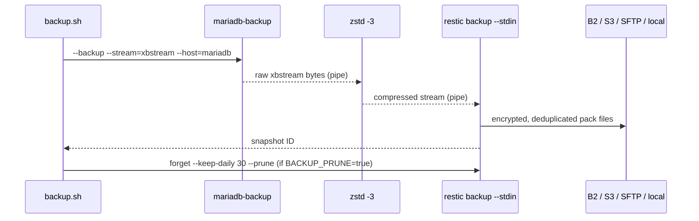

# Backup & restore

> Operator guide for the v0.2 backup pipeline. Covers what gets backed up, what
> doesn't, how to operate, how to restore, and the legal/compliance considerations
> operators carry.

⚠️ This guide assumes a running v0.2 Compose stack. Read
[DISCLAIMER.md](../DISCLAIMER.md) before deploying. Operators bear full
responsibility for GDPR compliance and data handling on their instance.

## TL;DR

The pipeline hot-snapshots MariaDB with `mariadb-backup`, compresses with
`zstd -3`, and writes into a Restic repository with AES-256 client-side
encryption. All you need is a Restic-compatible backend (Backblaze B2 is the
default) and a password stored somewhere safe. Snapshots land under
`b2:<your-bucket>:/ratatoskr` (or your configured path) and are pruned to 30
days automatically. The daily snapshot is a complete, self-contained physical
backup — no incremental chain, no chain dependency to lose.

## What gets backed up

**Covered: `mariadb-data` only.**

This is the only volume that cannot be reconstructed from external state. Every
other volume is recoverable:

- `redis-data` — Redis rebuilds its in-memory state from MariaDB when the
  Laravel queue workers reconnect. AOF persistence survives container restarts
  but is not critical for disaster recovery.
- `meilisearch-data` — the search index is derived data. Run
  `php artisan scout:import "App\Models\Torrent"` after a MeiliSearch reset to
  rebuild the index from MariaDB. UNIT3D may index additional models in newer
  releases (Users, TorrentRequests, Forum threads); check upstream for any
  project-specific re-index command.
  The MeiliSearch Dumps API (a future minor in the v0.2 series) will add
  optional snapshot coverage for operators who want faster re-index.
- `unit3d-storage` — avatars, banners, and `.torrent` files. The v0.4 K8s
  overlay migrates this to S3-compatible storage with a separate backup path.
  In v0.2 Compose, this volume is not covered; operators on a single host can
  back it up with a separate `restic backup` or `rsync` job against the Docker
  volume path (`/var/lib/docker/volumes/ratatoskr_unit3d-storage`).

**Roadmap**: `unit3d-storage` backups arrive in v0.4 alongside the S3
migration. A MeiliSearch dump helper is planned for a v0.2.x patch.

## How it works (mental model)



`mariadb-backup --backup --stream=xbstream` performs a hot physical copy of
InnoDB data files without locking writes for more than a brief moment. The
xbstream is piped directly into `zstd -3 --threads=0`, which compresses with
good ratio at low CPU cost (level 3 is the sweet spot for database streams).
The compressed bytes land in `restic backup --stdin`, which splits them into
content-addressed pack files, deduplicates across snapshots, and encrypts each
pack with AES-256-CTR authenticated by Poly1305-MAC before writing to the
backend. Nothing hits disk inside the container — the whole path is a streaming
pipe.

`restic forget --keep-daily 30 --prune` runs after each successful backup when
`BACKUP_PRUNE=true` (the default). It removes snapshot references older than 30
days and reclaims backend storage. See [Operational footguns](#operational-footguns)
for why you might want to run prune on a separate schedule for large repos.

## Key escrow ⚠️

**This is the most operationally critical section in this document.** A lost
`RESTIC_PASSWORD` makes every snapshot permanently unreadable. There is no
recovery path — Restic's encryption is intentionally irreversible without the
password. Plan before the first backup run, not after a disk failure.

### Why this matters

Restic uses a master key encrypted with your password. The master key encrypts
all pack files. If you lose the password, the master key cannot be recovered,
and neither can the data. This is the correct security property — but it means
key management is entirely your responsibility.

### Strategy 1: password manager + printed copy in a safe

Store the password in a password manager you control (Bitwarden self-hosted,
KeePassXC, 1Password). Print it on paper, seal it in an envelope, and keep it
in a physical safe or safety deposit box. This is the minimum viable escrow for
a single-operator deployment.

### Strategy 2: Shamir secret sharing

Split the password into N shares, require M to reconstruct. The `ssss` package
(available on Debian/Ubuntu as `apt-get install ssss`) implements
Shamir's Secret Sharing Scheme over the command line:

```bash
# Split into 5 shares, require 3 to reconstruct
ssss-split -t 3 -n 5 -q
# Paste your restic password when prompted.
# Distribute the 5 shares to 5 trusted parties (e.g. co-admins, lawyers, keyholders).

# Reconstruct:
ssss-combine -t 3 -q
# Paste any 3 shares when prompted.
```

This is the right model for multi-person operations or organisations where
no single person should hold the full key.

### Strategy 3: HSM-backed

Store the password in a hardware security module (YubiKey via `ykman`, AWS
CloudHSM, Hashicorp Vault with auto-unseal). This is overkill for a v0.2
single-host Compose deployment; it is mentioned for operators who already run
HSM infrastructure and want to integrate.

### What never to do

- Store the password in the same backend as the backups. If an attacker gets
  B2 credentials, they should not also get the decryption password.
- Store it in `.env` alongside `DB_PASSWORD` and `REDIS_PASSWORD`. Those files
  get copied to servers, shared in chat, and accidentally committed.
- Store it in a git repository — even a private one.
- Log it in chat messages, issue comments, or support tickets.

## One-time setup (deep dive)

The [Compose README quickstart](../compose/README.md#backup--restore) covers
the minimum commands. This section explains the rationale behind each step.

### Backup user creation

The `backup` MariaDB user needs exactly four privileges:

```sql
CREATE USER IF NOT EXISTS 'backup'@'%' IDENTIFIED BY '<generated-password>';
GRANT RELOAD, PROCESS, LOCK TABLES, BACKUP_ADMIN ON *.* TO 'backup'@'%';
FLUSH PRIVILEGES;
```

- `RELOAD` — required to flush binary log coordinates into the backup metadata.
- `PROCESS` — required to see all running transactions, so `mariadb-backup` can
  wait for long-running ones before acquiring the short backup lock.
- `LOCK TABLES` — required for `BACKUP STAGE` locking protocol on non-InnoDB
  tables.
- `BACKUP_ADMIN` — required in MariaDB 10.4+ for the `BACKUP LOCK` and
  `BACKUP STAGE` statements that replace the older `FLUSH TABLES WITH READ LOCK`
  path. Without this, backups fall back to a global read lock that blocks all
  writes for the duration.

Run this from the host after the stack is healthy (not in
`docker-entrypoint-initdb.d`, which only fires on a fresh volume and would leave
operators upgrading from v0.1 without the user):

```bash
mkdir -p secrets && chmod 700 secrets
openssl rand -hex 32 | tr -d '\n' > secrets/mariadb_backup_password
chmod 600 secrets/mariadb_backup_password

ROOT_PWD=$(grep ^MARIADB_ROOT_PASSWORD .env | cut -d= -f2-)
docker compose exec -e MYSQL_PWD="$ROOT_PWD" -T mariadb \
    mariadb -u root <<EOF
CREATE USER IF NOT EXISTS 'backup'@'%' IDENTIFIED BY '$(cat secrets/mariadb_backup_password)';
GRANT RELOAD, PROCESS, LOCK TABLES, BACKUP_ADMIN ON *.* TO 'backup'@'%';
FLUSH PRIVILEGES;
EOF
unset ROOT_PWD
```

The `cut -d= -f2-` form (trailing `-`) preserves everything after the first `=`,
so passwords that contain `=` survive. With hex passwords this never triggers,
but the pattern is correct regardless.

### Restic password generation

```bash
openssl rand -hex 32 | tr -d '\n' > secrets/restic_password
chmod 600 secrets/restic_password
```

Hex output is `[0-9a-f]` only: safe inside shell heredocs, SQL `IDENTIFIED BY`
clauses, JSON values, and every `.env` parser. Base64 output can contain `=`,
`+`, `/`, which break naive interpolation in those contexts. 32 bytes of entropy
(256 bits) is well above what any current or foreseeable brute-force attack can
reach.

### Restic repository initialisation

The backup script probes the repository on every run:

```bash
restic cat config > /dev/null 2>&1 || restic init
```

If the repo does not exist, `restic init` runs once and writes the repository
config, master key, and index structures to the backend. On every subsequent
run, `cat config` succeeds and `restic init` is skipped. No separate
initialisation step is needed on first run.

### Backend choice

| Backend | Pros | Cons |
|---|---|---|
| Backblaze B2 | Cheapest cloud storage ($0.006/GB/month), native Restic support, simple scoped keys | US-only data residency by default (EU bucket available) |
| Cloudflare R2 | Zero egress fees, S3-compatible, EU/US/APAC regions | $0.015/GB/month (2.5× B2) |
| AWS S3 | Industry standard, many regions | Expensive egress ($0.09/GB), over-engineered for this use case |
| MinIO (self-hosted) | Full data sovereignty, no external dependency | You operate another service; no offsite redundancy unless you replicate |
| SFTP | Simple, any Linux VPS you already have | No dedup at backend level (Restic handles dedup client-side anyway); key rotation is manual |
| Local path | Zero cost, zero latency | Not offsite — protects against volume corruption, not against host failure or theft |

## Backend setup recipes

### Backblaze B2 (default)

1. Create a bucket in the B2 console. Enable "Server-Side Encryption" on the
   bucket for defence-in-depth (Restic already encrypts client-side; SSE adds a
   second layer at rest).
2. Create a scoped Application Key with **Read and Write** on that bucket only.
   Never use the master application key in `.env.backup`.
3. Set in `.env.backup`:

```bash
RESTIC_REPOSITORY=b2:<your-bucket-name>:/ratatoskr
B2_ACCOUNT_ID=<key-id>
B2_ACCOUNT_KEY=<application-key>
```

The `:ratatoskr` prefix inside the bucket scopes the Restic repo. If you run
multiple ratatoskr instances, change this prefix per instance — see
[Operational footguns](#operational-footguns).

### Cloudflare R2

```bash
RESTIC_REPOSITORY=s3:<account-id>.r2.cloudflarestorage.com/<bucket-name>
AWS_ACCESS_KEY_ID=<r2-token-id>
AWS_SECRET_ACCESS_KEY=<r2-token-secret>
```

Generate the token in the Cloudflare dashboard under R2 → Manage R2 API Tokens.
Scope it to the target bucket with **Object Read & Write** only.

### AWS S3

```bash
RESTIC_REPOSITORY=s3:s3.amazonaws.com/<bucket-name>
AWS_ACCESS_KEY_ID=<access-key-id>
AWS_SECRET_ACCESS_KEY=<secret-access-key>
AWS_DEFAULT_REGION=eu-west-1
```

Minimal IAM policy for the backup user:

```json
{
  "Version": "2012-10-17",
  "Statement": [
    {
      "Effect": "Allow",
      "Action": [
        "s3:PutObject",
        "s3:GetObject",
        "s3:DeleteObject",
        "s3:ListBucket"
      ],
      "Resource": [
        "arn:aws:s3:::<bucket-name>",
        "arn:aws:s3:::<bucket-name>/*"
      ]
    }
  ]
}
```

### MinIO (self-hosted)

```bash
RESTIC_REPOSITORY=s3:http://<minio-host>:9000/<bucket-name>
AWS_ACCESS_KEY_ID=<minio-access-key>
AWS_SECRET_ACCESS_KEY=<minio-secret-key>
```

For TLS MinIO, drop the `http://` scheme; Restic defaults to HTTPS:
`s3:<minio-host>:9000/<bucket-name>`.

### SFTP

```bash
RESTIC_REPOSITORY=sftp:<user>@<host>:/opt/restic-repos/ratatoskr
```

The backup container runs as the `mysql` user (UID 999) which has no shell
home and no `~/.ssh` directory. Mounting an SSH key at `/root/.ssh/` would
silently fail because that path is not readable by UID 999. The supported
pattern is to ship the SSH key as a Docker secret (mounted at
`/run/secrets/<name>`, world-readable inside the container) and tell Restic
to use a custom SSH invocation via `RESTIC_SSH_COMMAND`.

**Step 1 — generate the key pair on the host and chmod the private key:**

```bash
ssh-keygen -t ed25519 -N '' -f compose/secrets/sftp_id_ed25519 -C ratatoskr-backup
chmod 600 compose/secrets/sftp_id_ed25519
# Push the .pub file to the SFTP server's authorized_keys for the backup user.
```

**Step 2 — add the secret to `compose/docker-compose.backup.yml`:**

```yaml
secrets:
  sftp_ssh_key:
    file: ./secrets/sftp_id_ed25519
  sftp_known_hosts:
    file: ./secrets/sftp_known_hosts

services:
  unit3d-backup:
    secrets:
      - sftp_ssh_key
      - sftp_known_hosts
    environment:
      RESTIC_SSH_COMMAND: "ssh -i /run/secrets/sftp_ssh_key -o UserKnownHostsFile=/run/secrets/sftp_known_hosts -o StrictHostKeyChecking=yes"
```

**Step 3 — populate `known_hosts` (two strategies):**

The hardened path: pre-fetch the host fingerprint on a trusted network, commit
the file as a secret, and keep `StrictHostKeyChecking=yes` so any future
fingerprint change aborts the connection.

```bash
ssh-keyscan -H sftp.example.com > compose/secrets/sftp_known_hosts
chmod 600 compose/secrets/sftp_known_hosts
# Verify the fingerprint out-of-band against your SFTP provider's documentation.
```

The quick path (one-shot tests, accept-on-first-connect TOFU): swap the
`StrictHostKeyChecking` and `UserKnownHostsFile` options in the
`RESTIC_SSH_COMMAND` value:

```yaml
    environment:
      RESTIC_SSH_COMMAND: "ssh -i /run/secrets/sftp_ssh_key -o StrictHostKeyChecking=accept-new -o UserKnownHostsFile=/var/lib/mysql/.ssh/known_hosts"
```

`accept-new` trusts whatever fingerprint shows up on first connect and pins
it. This is fine for one-shot testing but a MITM at first connect is not
detectable. Production deployments should use the hardened path.

> ⚠️ Docker secrets are mounted at `/run/secrets/<name>` with mode `0444`
> (world-readable inside the container). The host file should be `chmod 600`
> so it is not readable by other users on the host. Inside the container,
> the `mysql` user can read the secret because the secret tmpfs mount is
> world-readable by Docker design.

### Local path

```bash
RESTIC_REPOSITORY=/restic-repo
```

Mount a separate physical disk at that path. Add to `docker-compose.backup.yml`
under `unit3d-backup.volumes`:

```yaml
- /mnt/backup-disk/restic-repo:/restic-repo
```

A local-path backend with the backup data on the same physical disk as
`mariadb-data` protects only against volume corruption, not against disk
failure. Use this only when the backup disk is physically separate from the
data disk.

## Daily schedule

### Option A: host cron

```cron
# /etc/cron.d/ratatoskr-backup
# Runs daily at 03:00 local time. WorkingDirectory must be the compose directory.
0 3 * * * root cd /opt/ratatoskr/compose && \
    docker compose -f docker-compose.yml -f docker-compose.backup.yml \
        --profile backup run --rm unit3d-backup \
    >> /var/log/ratatoskr-backup.log 2>&1
```

Add log rotation to avoid unbounded growth:

```bash
# /etc/logrotate.d/ratatoskr-backup
/var/log/ratatoskr-backup.log {
    daily
    rotate 30
    compress
    missingok
    notifempty
}
```

### Option B: systemd timer (recommended)

systemd timers fire missed runs on next boot (`Persistent=true`), integrate with
journald (no separate log file needed), and support `OnFailure=` for alerting.

```ini
# /etc/systemd/system/ratatoskr-backup.service
[Unit]
Description=ratatoskr daily MariaDB backup
After=docker.service
Requires=docker.service

[Service]
Type=oneshot
WorkingDirectory=/opt/ratatoskr/compose
ExecStart=/usr/bin/docker compose \
    -f docker-compose.yml \
    -f docker-compose.backup.yml \
    --profile backup run --rm unit3d-backup
StandardOutput=journal
StandardError=journal
SyslogIdentifier=ratatoskr-backup
```

```ini
# /etc/systemd/system/ratatoskr-backup.timer
[Unit]
Description=Run ratatoskr-backup daily at 03:00

[Timer]
OnCalendar=*-*-* 03:00:00
Persistent=true

[Install]
WantedBy=timers.target
```

Enable the timer:

```bash
systemctl daemon-reload
systemctl enable --now ratatoskr-backup.timer
# Verify
systemctl list-timers ratatoskr-backup.timer
```

Check recent runs:

```bash
journalctl -u ratatoskr-backup.service --since "7 days ago"
```

### Comparison

| | Host cron | systemd timer |
|---|---|---|
| Availability | Universal (any Linux) | Requires systemd |
| Missed-run recovery | No (`Persistent` not available) | Yes (`Persistent=true`) |
| Logging | File + logrotate | journald (built-in rotation, structured) |
| Failure alerting | Separate MAILTO or script | `OnFailure=` unit |
| Debugging | `grep` the log file | `journalctl -u` |

Use the systemd timer on any modern Debian/Ubuntu/RHEL host. Fall back to cron
only if the host runs a non-systemd init.

## Restore procedures

### Restore drill (non-destructive)

Run this after every backup image change, script change, and at least weekly in
production. It proves the full chain: snapshot is readable → `--prepare`
succeeds → `mariadbd` boots from the prepared datadir → sentinel rows are
present.

```bash
docker compose -f docker-compose.yml -f docker-compose.backup.yml \
    --profile backup run --rm unit3d-backup restore-test
```

The script pulls the latest snapshot to a `mktemp -d` scratch directory inside
the container (never touching `mariadb-data`), runs
`mariadb-backup --prepare` to roll forward committed transactions, spawns an
ephemeral `mariadbd --skip-networking --skip-grant-tables` on a Unix socket,
and queries:

```sql
SELECT COUNT(*) FROM users;
SELECT COUNT(*) FROM torrents;
```

Exit 0 means both queries succeeded and `users` contains at least one row (the
bootstrap admin from `DEFAULT_OWNER_*`). Exit 1 means the drill failed — the
operator must investigate before relying on this backup for production restore.

v0.2 commit #5 ships a Claude Code `restore-drill` skill that gates commits
touching `scripts/backup*.sh` on a successful drill. See
[`.claude/skills/restore-drill/`](../.claude/skills/restore-drill/).

### Full restore (destructive)

⚠️ This overwrites `mariadb-data`. Stop all consumers first. There is no undo.

Pre-flight checklist:

- Confirm the snapshot you intend to restore with `restic snapshots --tag ratatoskr-mariadb`
- Stop all services that hold open MariaDB connections
- Verify `RESTIC_REPOSITORY` and backend credentials in `.env.backup`
- Have the `secrets/restic_password` file present and readable

```bash
# 1. Stop all MariaDB consumers
docker compose stop unit3d unit3d-scheduler unit3d-queue

# 2. Stop MariaDB itself
docker compose stop mariadb

# 3. Restore from the latest snapshot. RESTORE_FORCE=true is mandatory
#    because mariadb-data is non-empty — the guard prevents accidental
#    overwrites of a running database.
docker compose -f docker-compose.yml -f docker-compose.backup.yml \
    --profile backup run --rm \
    -e RESTORE_FORCE=true unit3d-backup restore latest

# 4. Start MariaDB and verify it comes up healthy
docker compose start mariadb
docker compose ps mariadb   # wait for "healthy"

# 5. Start the application tier
docker compose start unit3d unit3d-scheduler unit3d-queue
```

Post-flight verification:

```bash
# Check user count via artisan
docker compose exec unit3d php artisan tinker --execute="echo \DB::table('users')->count();"

# Check application loads
curl -fsS http://localhost:8080/login | grep -q "Login" && echo "OK"
```

**Note on backup type**: every snapshot is a full physical backup. There is no
incremental chain. Restoring `latest` restores the complete database state at
the time of that snapshot — all tables, all rows, all binary log coordinates.

### Partial restore (point-in-time)

Restic keeps one snapshot per daily run. Granularity is daily — there is no
point-in-time recovery within a day (no binary log shipping in this pipeline;
that is a v0.7 concern alongside multi-node MariaDB).

To restore from a specific past snapshot rather than `latest`:

```bash
# List available snapshots
docker compose -f docker-compose.yml -f docker-compose.backup.yml \
    --profile backup run --rm unit3d-backup \
    restic snapshots --tag ratatoskr-mariadb

# Restore a specific snapshot by ID (first 8 chars are sufficient)
docker compose -f docker-compose.yml -f docker-compose.backup.yml \
    --profile backup run --rm \
    -e RESTORE_FORCE=true unit3d-backup restore <snapshot-id>
```

Replace `<snapshot-id>` with the short ID shown in `restic snapshots` output
(e.g. `a1b2c3d4`). The `restore` command accepts both short IDs and the full
64-character hash.

## GDPR & retention

### Retention window

The default is **30 days** (`--keep-daily 30`). This is a deliberate compromise
between recoverability and the right to erasure. Longer retention means more
recovery window for operator errors; shorter means user data ages out faster.
30 days matches common privacy policy commitments and gives ample recovery time
for most failure modes.

Adjust in `.env.backup` via `BACKUP_RETENTION_DAILY`. Operators in jurisdictions
with stricter requirements should reduce this. Operators running high-availability
setups with cross-region replication can reduce it further (7 days is
defensible if the live database is replicated).

### Right to erasure

When a user requests erasure under GDPR Art. 17, deleting their rows from the
live database does not remove them from existing backup snapshots. This is an
inherent limitation of physical database backups in any format (not specific to
mariadb-backup or Restic).

The practical position: document this in your privacy policy. State that deleted
user data may persist in encrypted backups for up to the retention window (30
days by default) and that backups are purged on schedule.

Hard mitigation is not feasible with the xbstream physical backup format —
individual rows cannot be rewritten inside a compressed, encrypted pack file.
The soft mitigation is a tight retention window so the data ages out quickly
after deletion.

Restic's client-side encryption satisfies GDPR Art. 32 (appropriate technical
measures for data security). All backup data is AES-256-CTR encrypted with a
Poly1305-MAC authentication tag before leaving the host.

### Encryption at rest

GDPR Art. 32 requires "appropriate technical and organisational measures" to
protect personal data. Restic provides AES-256-CTR + Poly1305-MAC on every pack
file by default. There is no opt-out — disabling encryption would require
patching Restic. This means every ratatoskr backup is encrypted at rest as long
as the password is not stored alongside the backups.

## Operational footguns

- **Multi-instance shared Restic repo**: if you run two ratatoskr instances
  pointing at the same backend path, set a different `BACKUP_HOSTNAME` in each
  `.env.backup`. Otherwise `restore latest` on instance B may pull a snapshot
  from instance A. Use `--tag ratatoskr-mariadb` and distinct hostnames.

- **`--use-memory` for large datasets**: `mariadb-backup --prepare` defaults to
  100 MB of sort buffer. On databases larger than ~5 GB, this causes excessive
  temporary-file I/O and slow prepares. A future patch will surface this as a
  `BACKUP_PREPARE_MEMORY` env var; until then, operators editing
  `scripts/restore.sh` can pass `--use-memory=1G` directly on the
  `mariadb-backup --prepare` line.

- **Restic prune locking**: `restic backup` and `restic forget --prune` both
  acquire a repository lock. If a backup run is still in progress when the prune
  fires (e.g. a slow upload on a fat snapshot), the prune fails with "lock
  held". Set `BACKUP_PRUNE=false` on the daily backup job and add a separate
  weekly prune-only job:

  ```bash
  # /etc/cron.d/ratatoskr-prune — weekly on Sunday at 04:00
  0 4 * * 0 root cd /opt/ratatoskr/compose && \
      docker compose -f docker-compose.yml -f docker-compose.backup.yml \
          --profile backup run --rm \
          -e BACKUP_PRUNE=false unit3d-backup \
          restic forget --tag ratatoskr-mariadb --keep-daily 30 --prune \
      >> /var/log/ratatoskr-prune.log 2>&1
  ```

- **Restoring across MariaDB major versions**: `mariadb-backup --copy-back`
  restores into the exact same major version it backed up. Restoring a MariaDB
  11 snapshot into a MariaDB 10.6 container is unsupported and will corrupt the
  datadir. `MARIADB_BACKUP_VERSION` is a build-time variable consumed by
  `compose/docker-compose.backup.yml` under `args:` — Compose substitutes it
  from the host shell or from `compose/.env` (auto-loaded), **not** from
  `.env.backup` (which only feeds the runtime container env). Set it in
  your shell before `docker compose build`, or commit it to `compose/.env`
  alongside the other build vars.

  > ⚠️ `MARIADB_BACKUP_VERSION` must always equal the running MariaDB server
  > version. Bumping one without the other defeats the version-lock contract
  > that justifies the entire backup pipeline (mariadb-backup is exact-major
  > matched to the server).

- **Test restores are not optional**: backups that have never been tested are
  guesses, not backups. The restore drill (see above) and the `restore-drill`
  skill (v0.2 commit #5) exist specifically because operators skip this step
  until a disaster forces them not to.

## Future hardening

For operators planning long-term:

- **GPG signature verification on the Restic binary**: the backup Dockerfile
  pins Restic by SHA256. Restic's upstream release process publishes a GPG
  signature alongside each binary. A future hardening pass will verify the GPG
  signature in the build stage, not just the hash. (Restic uses GPG, not
  Cosign — tracking issue linked from the ROADMAP.)

- **Per-snapshot SLSA attestations**: the ratatoskr CI pipeline already produces
  SLSA provenance for the application image. Extending this to backup snapshots
  (a `restic tag` linking snapshot ID to a signed attestation) is a stretch goal
  for v0.2.x.

- **Repo replication**: `restic copy --from-repo <source> <destination>` copies
  all snapshots to a second backend. Run this after each backup job to maintain
  an offsite copy. This does not require re-uploading data already present in the
  destination (Restic deduplicates by content hash across repos when possible).

## Threat model

What this pipeline protects against and what it does not:

- ✅ Disk failure on the database host — snapshot is offsite, restore from backend.
- ✅ Docker volume corruption — same recovery path.
- ✅ Operator error (accidental `DROP DATABASE`, bulk delete) within the retention
  window — restore from the snapshot preceding the error.
- ⚠️ Compromised backup credentials with write access — an attacker with B2
  credentials can delete snapshots (the repo is not read-only for the backup
  key). Mitigation: create an append-only B2 key (B2 supports object lock); or
  use a separate write-once key for uploads and a separate read-only key for
  restores. `restic --read-only` prevents the restore key from modifying the repo.
- ✗ Compromised host with root access — an attacker on the host can read
  `/run/secrets/restic_password` and decrypt all snapshots. Mitigation is host
  hardening, outside the scope of this pipeline.
- ✗ Total backend loss — if the B2 bucket is deleted or the account is
  suspended, all snapshots are gone. Mitigation: replicate the repo to a second
  backend via `restic copy` (see [Future hardening](#future-hardening)).

## See also

- [DISCLAIMER.md](../DISCLAIMER.md) — operator legal responsibility
- [`.claude/skills/restore-drill/`](../.claude/skills/restore-drill/) — automated drill skill (v0.2 commit #5)
- [compose/README.md — Backup & restore](../compose/README.md#backup--restore) — quickstart commands
- [docs/ROADMAP.md](./ROADMAP.md) — v0.4 brings `unit3d-storage` backups via S3
