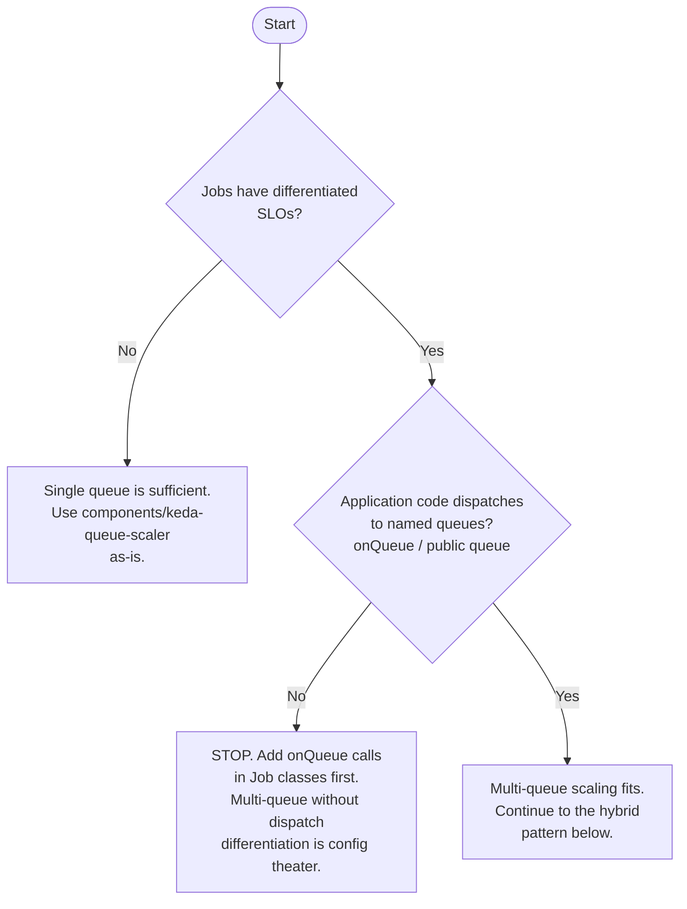

# Multi-queue scaling

ratatoskr v0.3 ships single-queue scaling via `components/keda-queue-scaler`: one `unit3d-queue`
Deployment, one ScaledObject, all jobs flow through Laravel's `default` queue. That baseline
covers the common case. Multi-queue scaling adds operational complexity and is only worth it when
jobs have differentiated SLOs — user-facing notifications that must complete in seconds should not
share a backlog with batch RSS re-indexing that can take minutes. When a slow batch backlog blocks
fast user-facing jobs, multi-queue is the correct answer. When jobs are uniform, it is unnecessary
overhead.

This is operator-extension territory. The base + Component combination is the supported v0.3/v0.4
default. The pattern below is a recipe operators apply themselves by extending their overlay.

See the [decision tree](#decision-tree) below before committing to this path.

## Decision tree



## Laravel queue model — refresher

Laravel queues are named string identifiers, not numeric priorities. Workers consume from one or
more queues via `php artisan queue:work --queue=A,B,C`. The list is **priority order, not
round-robin**: the worker drains A completely before pulling from B, and B before C. The same queue
can be consumed by multiple workers in parallel (fan-out). Job classes target a named queue via
`$this->onQueue('high')` at dispatch, or via the `public $queue = 'high'` class property. A queue
with no active consumer accumulates a backlog indefinitely — there is no automatic rerouting.

## ⚠️ UNIT3D queue usage at v9.2.0

All nine Job classes in UNIT3D v9.2.0 (`app/Jobs/`) dispatch to the `default` queue. None declare
a `public $queue` property or call `->onQueue()`. The Redis queue connection in `config/queue.php`
reads from `env('REDIS_QUEUE', 'default')` with no prefix override. The `.env.example` sets
`QUEUE_CONNECTION=redis` but does not define `REDIS_QUEUE`. Verified at the v9.2.0 tag against
all nine Job classes:

- `ProcessAnnounce`, `ProcessBackup`, `ProcessIgdbGameJob`, `ProcessMassPM`, `ProcessMovieJob`,
  `ProcessTvJob`, `SendDeleteUserMail`, `SendDisableUserMail`, `SendMassEmail`

**Consequence for operators**: multi-queue scaling adds zero value to a vanilla UNIT3D install. All
jobs land in `queues:default`. High and low lane workers idle at zero replicas forever. To benefit
from multi-queue, operators must fork the ratatoskr image and add `->onQueue()` calls (or
`public $queue` properties) to the relevant Job classes. Distributing a modified image triggers
AGPL-3.0 §13 source-disclosure obligations. For most deployments, raising `maxReplicaCount` on the
single `keda-queue-scaler` Component is the better option.

If a future UNIT3D release dispatches jobs to named queues, update this section with the queue
names, the relevant Job file paths, and the corresponding Redis list keys.

## The hybrid pattern: Component + inline

### Why not patch the Component

Kustomize Components are designed for orthogonal feature toggles — presence or absence of a
feature, not N-copy templating. The `keda-queue-scaler` Component declares fixed resource names
(`unit3d-queue` for both the Deployment and ScaledObject). Referencing that Component three times
in a single overlay produces resource-name collisions. N-copy templating is what overlays with
inline resources do.

The correct approach is a **hybrid pattern**: use the Component for the `default` lane unchanged,
and add plain YAML files inside the overlay for each additional lane.

### Directory layout

For an overlay with three lanes (`high`, `default`, `low`):

```text
kustomize/overlays/<env>/
├── kustomization.yaml          # Component reference + inline lane resources
├── unit3d-queue-high.yaml      # inline: Deployment + ScaledObject for the high lane
└── unit3d-queue-low.yaml       # inline: Deployment + ScaledObject for the low lane
```

### Resource ownership

The Component covers the `default` lane. It produces:

- A Deployment named `unit3d-queue` consuming `--queue=default` (via the base Deployment with no
  `--queue=` flag, which defaults to `default`)
- A ScaledObject named `unit3d-queue` scaling that Deployment from the `queues:default` Redis list

Each additional lane lives in the overlay as a plain YAML file, not inside the Component. The
overlay's `kustomization.yaml` combines both:

```yaml
# kustomize/overlays/<env>/kustomization.yaml (excerpt)
components:
  - ../../components/keda-queue-scaler   # handles the default lane

resources:
  - unit3d-queue-high.yaml               # handles the high lane
  - unit3d-queue-low.yaml                # handles the low lane
```

The inline resources are not a Component fork. They are plain Kubernetes manifests that mirror the
Component's structure with different names, `--queue=` flags, and tuned ScaledObject parameters.

## Worked example: 3 lanes (high, default, low)

### `unit3d-queue-high.yaml`

The Deployment mirrors `kustomize/base/unit3d-queue/deployment.yaml` exactly. The only deltas are
the name, the queue argument, and the lane label.

```yaml
apiVersion: apps/v1
kind: Deployment
metadata:
  name: unit3d-queue-high
  namespace: unit3d
  labels:
    app.kubernetes.io/name: unit3d-queue-high
    app.kubernetes.io/instance: ratatoskr
    app.kubernetes.io/component: queue-worker
    app.kubernetes.io/part-of: ratatoskr
    app.kubernetes.io/managed-by: Kustomize
    ratatoskr.io/queue-lane: high
spec:
  replicas: 1
  strategy:
    type: Recreate
  selector:
    matchLabels:
      app.kubernetes.io/name: unit3d-queue-high
  template:
    metadata:
      labels:
        app.kubernetes.io/name: unit3d-queue-high
        app.kubernetes.io/component: queue-worker
        ratatoskr.io/queue-lane: high
    spec:
      terminationGracePeriodSeconds: 3600
      securityContext:
        runAsNonRoot: true
        runAsUser: 33
        runAsGroup: 33
        fsGroup: 33
      containers:
        - name: unit3d-queue-high
          image: ghcr.io/john6810/unit3d:v9.2.0
          imagePullPolicy: IfNotPresent
          command:
            - php
            - /app/artisan
            - queue:work
            - --tries=3
            - --max-time=3600
            - --sleep=3
            - --queue=high
          envFrom:
            - configMapRef:
                name: unit3d-config
            - secretRef:
                name: unit3d-secrets
            - secretRef:
                name: mariadb-secrets
            - secretRef:
                name: redis-secrets
            - secretRef:
                name: meilisearch-secrets
            - secretRef:
                name: unit3d-storage-secrets
                optional: true
          resources:
            requests:
              cpu: 100m
              memory: 256Mi
            limits:
              cpu: 500m
              memory: 1Gi
          securityContext:
            allowPrivilegeEscalation: false
            readOnlyRootFilesystem: true
            capabilities:
              drop:
                - ALL
          livenessProbe:
            exec:
              command:
                - php
                - /app/artisan
                - --version
            initialDelaySeconds: 15
            periodSeconds: 60
            timeoutSeconds: 10
            failureThreshold: 3
          volumeMounts:
            - name: filesystems-config
              mountPath: /app/config/filesystems.php
              subPath: filesystems.php
              readOnly: true
            - name: storage
              mountPath: /app/storage
            - name: bootstrap-cache
              mountPath: /app/bootstrap/cache
            - name: caddy-data
              mountPath: /data/caddy
            - name: caddy-config
              mountPath: /config/caddy
            - name: tmp
              mountPath: /tmp
      volumes:
        - name: filesystems-config
          configMap:
            name: unit3d-filesystems-config
        - name: storage
          persistentVolumeClaim:
            claimName: unit3d-storage
        - name: bootstrap-cache
          emptyDir: {}
        - name: caddy-data
          emptyDir: {}
        - name: caddy-config
          emptyDir: {}
        - name: tmp
          emptyDir: {}
---
apiVersion: keda.sh/v1alpha1
kind: ScaledObject
metadata:
  name: unit3d-queue-high
  namespace: unit3d
  labels:
    app.kubernetes.io/name: unit3d-queue-high
    app.kubernetes.io/component: queue-worker
    ratatoskr.io/queue-lane: high
spec:
  scaleTargetRef:
    name: unit3d-queue-high
  minReplicaCount: 0
  maxReplicaCount: 8
  pollingInterval: 15
  cooldownPeriod: 60
  triggers:
    - type: redis
      metadata:
        # FQDN required: KEDA's controller pod runs in the keda namespace.
        # Short-name `redis` would resolve in KEDA's namespace, not unit3d.
        address: redis.unit3d.svc.cluster.local:6379
        # Laravel's RedisQueue writes list keys as queues:<name>.
        # UNIT3D v9.2.0 uses the framework default — no REDIS_QUEUE_PREFIX
        # override in config/queue.php or .env.example.
        listName: queues:high
        listLength: "5"
        databaseIndex: "0"
        enableTLS: "false"
      authenticationRef:
        name: unit3d-queue-redis-auth
  advanced:
    horizontalPodAutoscalerConfig:
      behavior:
        scaleUp:
          stabilizationWindowSeconds: 0
          policies:
            - type: Percent
              value: 100
              periodSeconds: 15
        scaleDown:
          stabilizationWindowSeconds: 60
          policies:
            - type: Percent
              value: 50
              periodSeconds: 30
```

For the low-priority lane, copy `unit3d-queue-high.yaml` to `unit3d-queue-low.yaml` and change:

- All occurrences of `high` → `low` in names and labels
- `--queue=high` → `--queue=low`
- `listName: queues:high` → `listName: queues:low`
- `minReplicaCount: 0` stays — low lane scales to zero when idle
- `maxReplicaCount: 8` → tune down (e.g. `4`) if low-priority jobs are bounded-throughput batch
- `cooldownPeriod: 60` → `cooldownPeriod: 300` — let the low lane sit idle longer before
  spinning back up; avoids scale-thrash on bursty batch arrivals

The `TriggerAuthentication` (`unit3d-queue-redis-auth`) is already created by the
`keda-queue-scaler` Component. Both the high and low lane ScaledObjects reuse it — no duplication
needed.

### Redis queue list naming

Laravel's `Illuminate\Queue\RedisQueue` writes queue list keys as `queues:<name>`. This is the
framework default. UNIT3D v9.2.0 does not override the prefix: `config/queue.php` uses
`env('REDIS_QUEUE', 'default')` for the queue name only, and `.env.example` does not define
`REDIS_QUEUE_PREFIX`. The resulting Redis list keys are:

| Lane | Redis list key |
|---|---|
| default | `queues:default` |
| high | `queues:high` |
| low | `queues:low` |

If an operator sets `REDIS_QUEUE_PREFIX` via a custom Laravel config, they must adjust the
`listName` values accordingly. The framework's `queue.php` does not expose a prefix env var in
vanilla UNIT3D v9.2.0.

## Anti-patterns

**1. Multiple ScaledObjects targeting the same queue.** KEDA reads the `queues:high` LLEN from both
ScaledObjects and scales both Deployments in response, doubling worker count with no throughput
gain. One ScaledObject per logical lane. If you need more workers on a single lane, raise
`maxReplicaCount` on the single ScaledObject.

**2. Manual HPA and KEDA ScaledObject on the same Deployment.** A ScaledObject creates its own
underlying HPA as its scaling primitive. A manually-added HPA on the same Deployment produces
conflicting scale signals; both controllers fight over `spec.replicas`. The same constraint is
documented in [`kustomize/components/keda-queue-scaler/README.md`](../kustomize/components/keda-queue-scaler/README.md)
for the single-queue case. It applies per lane.

**3. One worker consuming all lanes via priority order.** Running `--queue=high,default,low` on a
single Deployment defeats the purpose of lane isolation. Laravel drains `high` completely before
pulling from `default`, and `default` before `low`. Under sustained high-lane load, the low lane
starves indefinitely. Multi-lane scaling requires separate Deployments with dedicated capacity per
lane.

**4. Fallback consumption blurring lane boundaries.** Configuring a high-lane worker as
`--queue=high,default` causes it to steal default-lane work when its own queue is empty. The
default-lane ScaledObject then sees its queue drain faster than its own workers caused, skewing
scale decisions and leaving the default-lane Deployment scaled to zero longer than expected. Each
lane Deployment consumes only its own queue.

**5. Multi-queue config without `->onQueue()` in application code.** Inline ScaledObjects and extra
Deployments produce zero scaling benefit if every job still dispatches to `default`. The high and
low lane workers idle at zero replicas forever. Address the application layer first — and observe
the AGPL-3.0 §13 source-disclosure implication if you fork the image to add the dispatch calls.
See [security-hardening.md](./security-hardening.md) for the supply-chain and image-distribution
context.

## Trade-offs

| Concern | Single-queue baseline | Multi-queue (this doc) |
|---|---|---|
| Pod count at peak | 1 Deployment × `maxReplicaCount` | N lanes × `maxReplicaCount` each — plan node capacity |
| KEDA polling load | 1 ScaledObject = 1 Redis poll per `pollingInterval` | N ScaledObjects = N polls per interval — tune `pollingInterval` if Redis CPU climbs |
| Cooldown tuning | One value for all jobs | Per-lane: high lane wants 10–60 s, low lane wants 3–5 min to avoid scale-thrash |
| Observability surface | 1 set of worker metrics | N sets of metrics — N× more PromQL queries in dashboards |
| Operator maintenance | Component apply, done | Per-lane YAML in the overlay to maintain |
| Value in vanilla install | Full — all jobs benefit | None — UNIT3D v9.2.0 dispatches everything to `default`; requires image fork |

For dashboard sketches and queue-related alert rules, see [monitoring.md](./monitoring.md).

## See also

- [`kustomize/components/keda-queue-scaler/README.md`](../kustomize/components/keda-queue-scaler/README.md) — single-queue baseline, authentication wiring, HPA conflict constraint
- [`docs/architecture.md`](./architecture.md) — component overview and queue worker placement in the full deployment graph
- [`docs/monitoring.md`](./monitoring.md) — KEDA scaler health metrics and queue depth alerts
- [KEDA Redis Lists scaler](https://keda.sh/docs/latest/scalers/redis-lists/) — trigger parameters reference
- [Laravel queues documentation](https://laravel.com/docs/12.x/queues) — `queue:work` flags, named queues, job dispatch
